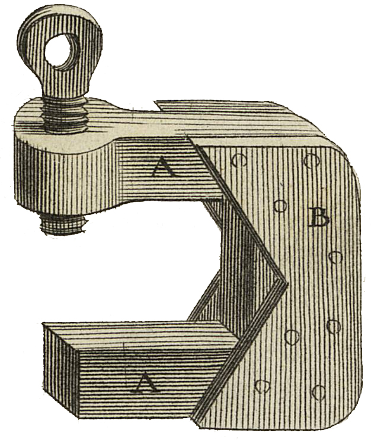
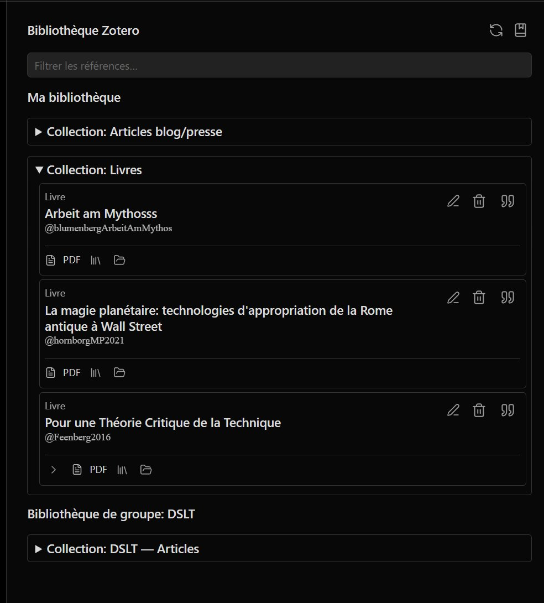
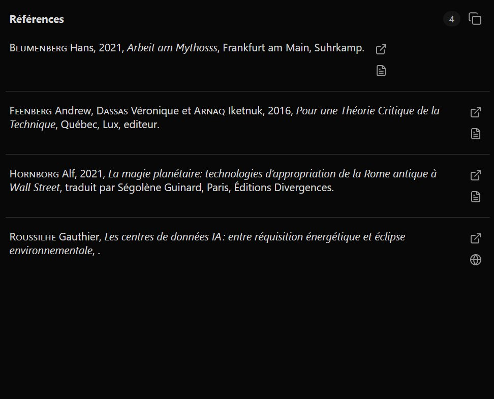

<div align="center">

<table>
<tr>
<td></td>
<td align="left">
<h1 style="margin:0">PandoCit</h1>
<p style="margin:0.25em 0 0"><strong>Pandoc citations in Obsidian</strong><br/>sidebar panel · WASM bibliography · Zotero integration</p>
</td>
</tr>
</table>

<a href="https://atelier.atechnologie.fr/" title="l'Atelier – book-making and research-tools association"></a>  
<sub>Developed by <a href="https://atelier.atechnologie.fr/">l'Atelier</a> — book-making and research tools (EHESS)</sub>

<p>
🇫🇷 <a href="README.md">Français</a> ·
🇬🇧 <a href="README.en.md"><b>English</b></a> ·
🇩🇪 <a href="README.de.md">Deutsch</a> ·
🇪🇸 <a href="README.es.md">Español</a>
</p>

<p>
<a href="https://atelier.atechnologie.fr/"></a>
<a href="https://github.com/Atelier-Recherche/pandocit"></a>
<a href="https://obsidian.md/plugins?search=BRAT#"></a>
</p>

</div>

---

## 📸 Preview

| Reference list | Library |
| :---: | :---: |
|  |  |

---

## 📖 About

Shows a formatted reference list in the sidebar for each Pandoc citation key (`[@key]`) in the active note.

## ⬇️ Install via BRAT (one click)

> **Plugin ID (Obsidian community)** : `pandocit` — the folder under `.obsidian/plugins/` must be named **`pandocit`** (IDs cannot contain `obsidian`; see [Manifest guidelines](https://docs.obsidian.md/Reference/Manifest)). Migrating from `obsidian-pandoc-reference-list`? Rename the folder or reinstall, then copy `data.json` and `pandoc.wasm`.

1. 🔌 Install **BRAT**: [Obsidian — BRAT](https://obsidian.md/plugins?search=BRAT#)
2. ➕ Add this repo with *“Add Beta plugin”*:  
   `https://github.com/Atelier-Recherche/pandocit`

> 💡 Our plugins may still be pending Obsidian community review; BRAT lets you try them now. See also 🌐 [l'Atelier](https://atelier.atechnologie.fr/).

## ⚙️ How it works

- 🦀 Uses **Pandoc 3.9 WebAssembly** (`pandoc.wasm`) to convert bibliography files (BibTeX, etc.) to CSL JSON. **No system Pandoc install required.**
- 📱 Works on **Obsidian desktop** (Windows, macOS, Linux) **and mobile** (Android, iOS).

## 🔧 Configuration

1. **📚 Bibliography**  
   Path to your bibliography file (Pandoc-compatible: `.bib`, CSL `.json`, etc.).  
   - 🖥️ **Desktop**: file picker or absolute / vault-relative path.  
   - 📱 **Mobile**: **vault-relative** path only (e.g. `refs/library.bib`). File dialog is desktop-only.

2. **🎨 Citation style (CSL)** *(optional)*  
   Built-in list or `.csl` file (path or URL); overridable via note frontmatter (`bibliography`, `csl`, `lang`, etc.).

3. **📋 Reference panel**  
   Command palette: **“PandoCit : Show reference list”** (label depends on Obsidian UI language).

4. **🌐 Plugin language** *(optional)*  
   Plugin settings: UI language for labels (settings, item editor, dedicated sidebar).

## 📚 Zotero (optional)

### 🔗 Better BibTeX / local feed

**Better BibTeX** and local network sync work best on **desktop**. On mobile, prefer a bibliography file in the vault.

### ☁️ Zotero Web API

When enabled in settings:

- 🔑 **API key** and **personal** or **group** library (numeric ID).
- 👥 **Merge group libraries**: group IDs + **Load groups** or **custom display names** (one line per ID + label).
- 🔄 **Bidirectional sync** (Zotero API model).
- 📤 Optional **BibTeX export** to a vault `.bib` (for Pandoc, LaTeX, Typst).

Data is stored as JSON in the plugin folder; **no local Zotero Node install** — offline vault use after sync.

### 🌳 “Library” panel

Command: **“Open library panel”**.

**Tree view** (collections, unfiled items, standalone attachments, trash). Filter, edit items (including Zotero HTML notes), **PDF / file** attachments on each row.

- **▸ Collapsed subtrees by default**: chevron in the attachment strip to expand / collapse children.
- **🏷️ Type badges** (book, journal article…) follow the **plugin UI language** when supported.

Use **“Sync Zotero library (Web API)”** to refresh after the first sync.

### 📥 Import vault PDF folder to Zotero

Command **“Import vault PDF folder to Zotero”**: recursive scan, duplicate detection, suggested citation keys (author + year + title initials), long/short PDF collections, linked or uploaded attachments. Settings: default folder, exclusion patterns, filename regex.

## 📄 Built-in PDF reader

- Open PDFs from the vault in Obsidian's native PDF reader.
- **Highlights** to PDF and/or **Zotero** (Web API), saved styles, context menu.
- **Annotations panel**: unified list, Pandoc reference copy (`> quote`, Obsidian link, `[@citekey]`).
- Sync with Zotero attachments linked to vault files.

## 📗 Built-in EPUB reader

- **foliate-js** reader in Obsidian (navigation, local highlights).
- Annotation **sidecar** next to the EPUB.
- Early **Zotero** linking (read/push highlights when EPUB attachment is matched) — see roadmap below.

## 📝 Hypothesis (optional)

API token and group in settings. **Import** Hypothesis annotations into the document panel (EPUB); **export** local annotations to Hypothesis. UI hidden when not configured.

## 🗺️ Roadmap (summary)

Today: **Pandoc citations + Zotero API + PDF** are the most mature; **EPUB** and **Hypothesis** have a working base that still needs polish.

| Priority | EPUB | Hypothesis | Other |
| :---: | --- | --- | --- |
| **Short term** | Annotations panel parity with PDF; Zotero HTML notes from library; reliable highlight ↔ Zotero (CFI) | Test matrix (vault URIs, groups, round-trip import/export); clearer errors | Vault PDF import UX |
| **Medium term** | In-book search; typography prefs; PDF-like Zotero targets | Rich selectors; same work on web/PDF | Copy reference from EPUB annotations |
| **Long term** | PDF/EPUB feature parity (overlay, mobile) | Scheduled sync, conflict handling | Obsidian community listing; broader CI tests; offline PDF assets |

**EPUB**

- [x] Foliate reader, sidecar, basic toolbar
- [x] Read Zotero annotations; push highlights via API
- [ ] Zotero **notes** on EPUB items
- [ ] Smooth bidirectional highlight sync
- [ ] Full document annotations panel integration
- [ ] Large files & mobile testing

**Hypothesis**

- [x] Token + group; import search API; export POST
- [ ] Systematic tests (browser PDF, EPUB, multiple URIs)
- [ ] Network resilience and API limits
- [ ] Alignment with Zotero flow (dedup, source choice)

**Other ideas**

- Global search across recent document annotations.
- Batch export of reading-session references.
- Zotero sync reminder before `.bib` export.
- Reading-note templates from annotations (Typst, etc.).

> Checkboxes reflect the repo at doc update time; track changes on [GitHub Issues](https://github.com/Atelier-Recherche/pandocit/issues).

## 💻 Development and build

Requires [Node.js](https://nodejs.org/) and [Yarn](https://yarnpkg.com/).

```bash
yarn install
yarn build
```

CI/release uses `yarn install --frozen-lockfile --ignore-scripts` (skips `@codemirror/language` git `prepare` script).

Build outputs include:

- `main.js` (bundle; not in git — see [GitHub releases](https://github.com/Atelier-Recherche/pandocit/releases))
- `manifest.json`, `styles.css`
- `pdf.worker.min.mjs`, `foliate-view.mjs` (optional in the vault; worker embedded in `main.js`; EPUB reader downloadable from settings)
- `pdf-assets/`, `foliate/` (build outputs, not in git; `foliate/` is used to produce `foliate-view.mjs`)

**Local deploy** (Windows): `.\Deploy-LocalPlugin.ps1` — copies `main.js`, `manifest.json`, `styles.css`, `pdf.worker.min.mjs`, and `foliate-view.mjs` to your vault plugin folder (keeps `data.json` and `pandoc.wasm`).

**Release**: `.\Release-Plugin.ps1` bumps version, builds, commits, tags, pushes; [.github/workflows/release.yml](.github/workflows/release.yml) publishes **only** `main.js`, `manifest.json`, and `styles.css` (Obsidian community requirement). The PDF worker is **embedded in `main.js`**; optional `pdf.worker.min.mjs` download is in **plugin settings** (like `pandoc.wasm`).

Install **`pandoc.wasm`** from plugin settings in the vault (required for non-JSON bibliographies).

## ⚠️ Known limitations (WASM)

Pandoc WASM runs in a sandbox: no arbitrary network or shell commands. This plugin only uses bibliography → CSL JSON conversion.

## 🔗 Resources

| | |
| --- | --- |
| 🌐 **l'Atelier** | [atelier.atechnologie.fr](https://atelier.atechnologie.fr/) |
| 📦 **Repository** | [github.com/Atelier-Recherche/pandocit](https://github.com/Atelier-Recherche/pandocit) |
| 📄 **Pandoc** | [pandoc.org](https://pandoc.org/) — [Releases / pandoc.wasm 3.9](https://github.com/jgm/pandoc/releases) |
| 🎓 **CSL** | [citationstyles.org](https://citationstyles.org/) |

---

<div align="center">

<sub><a href="README.md">🇫🇷 Français</a> · 🇬🇧 English · <a href="README.de.md">🇩🇪 Deutsch</a> · <a href="README.es.md">🇪🇸 Español</a></sub>

</div>
