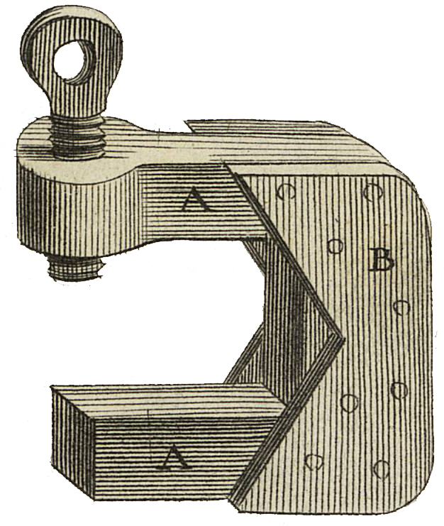
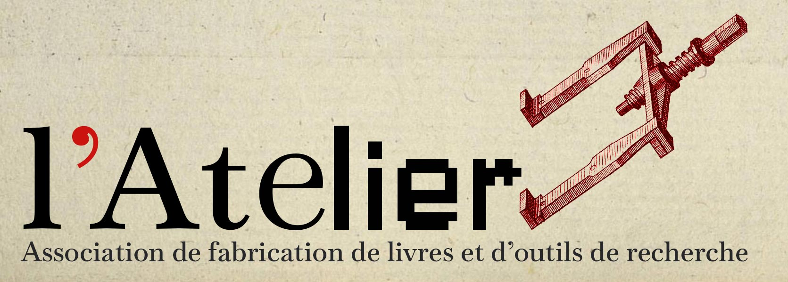
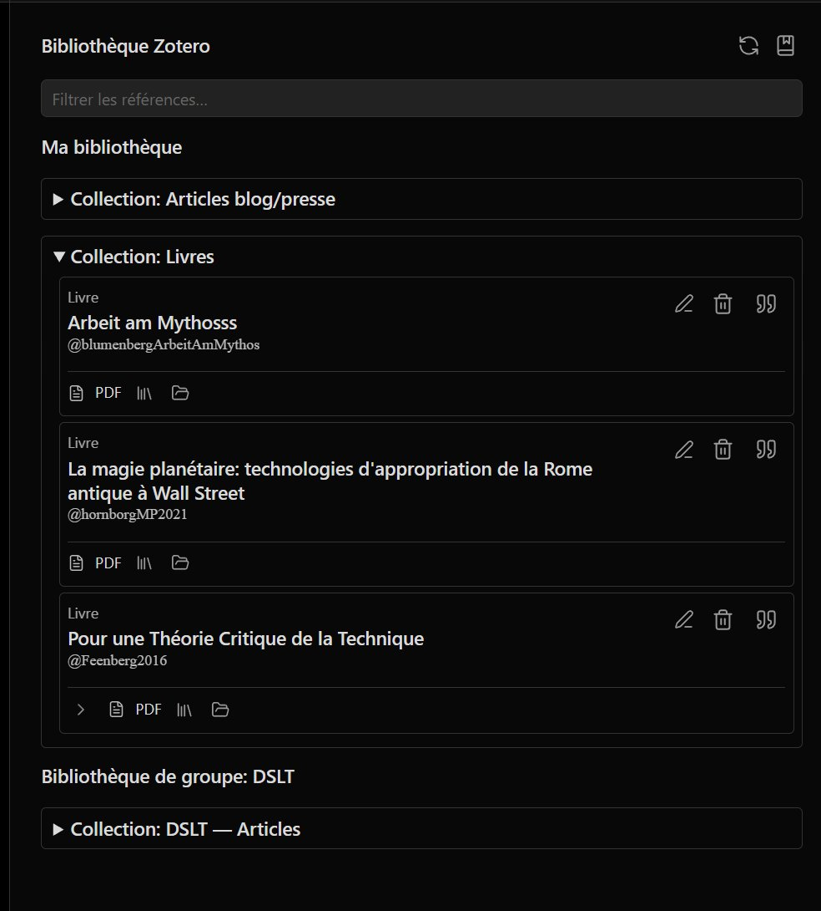
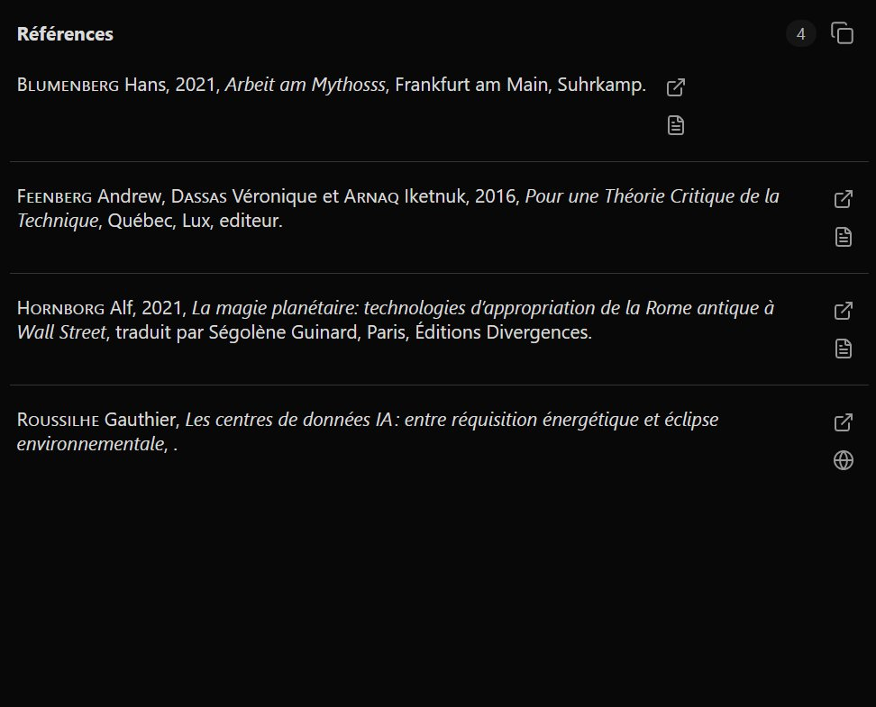

<div align="center">

<table>
<tr>
<td></td>
<td align="left">
<h1 style="margin:0">PandoCit</h1>
<p style="margin:0.25em 0 0"><strong>Citations Pandoc dans Obsidian</strong><br/>panneau latéral · bibliographie WASM · intégration Zotero</p>
</td>
</tr>
</table>

<a href="https://atelier.atechnologie.fr/" title="l'Atelier – Association de fabrication de livres et d'outils de recherche"></a>  
<sub>Développé par <a href="https://atelier.atechnologie.fr/">l'Atelier</a> — fabrication de livres et outils de recherche (EHESS)</sub>

<p>
🇫🇷 <a href="README.md"><b>Français</b></a> ·
🇬🇧 <a href="README.en.md">English</a> ·
🇩🇪 <a href="README.de.md">Deutsch</a> ·
🇪🇸 <a href="README.es.md">Español</a>
</p>

<p>
<a href="https://atelier.atechnologie.fr/"></a>
<a href="https://github.com/Atelier-Recherche/pandocit"></a>
<a href="https://obsidian.md/plugins?search=BRAT#"></a>
</p>

</div>

---

## 📸 Aperçu

| Liste des références | Bibliothèque Zotero |
| :---: | :---: |
|  |  |

---

## 📖 À propos

Affiche dans le panneau latéral une liste de références formatée pour chaque clé de citation Pandoc (`[@clef]`) présente dans la note active.

## ⬇️ Installation via BRAT (1 clic)

1. 🔌 Installer **BRAT** : [Obsidian — BRAT](https://obsidian.md/plugins?search=BRAT#)
2. ➕ Ajouter ce dépôt avec l’option *« Add Beta plugin »* :  
   `https://github.com/Atelier-Recherche/pandocit`

> 💡 Nos plugins peuvent être en attente de validation sur le catalogue Obsidian ; BRAT permet de les tester dès maintenant. Voir aussi 🌐 [l’Atelier](https://atelier.atechnologie.fr/).

## ⚙️ Fonctionnement

- 🦀 Le plugin utilise **Pandoc 3.9 en WebAssembly** (`pandoc.wasm`) pour convertir les fichiers de bibliographie (BibTeX, etc.) en CSL JSON. **Aucune installation de Pandoc sur le système n’est nécessaire.**
- 📱 Compatible **Obsidian bureau** (Windows, macOS, Linux) **et mobile** (Android, iOS) : le même plugin fonctionne sur ordinateur, téléphone et tablette.

## 🔧 Configuration

1. **📚 Bibliographie**  
   Indiquez le chemin vers votre fichier de bibliographie (compatible Pandoc : `.bib`, `.json` CSL, etc.).  
   - 🖥️ Sur **bureau** : bouton de sélection ou chemin absolu / relatif au coffre.  
   - 📱 Sur **mobile** : chemin **relatif au coffre** (ex. `refs/bibliographie.bib`). La boîte « ouvrir un fichier » n’est disponible que sur bureau.

2. **🎨 Style de citation (CSL)** *(optionnel)*  
   Liste intégrée ou fichier `.csl` (chemin ou URL), éventuellement surchargé par le frontmatter (`bibliography`, `csl`, `lang`, etc.).

3. **📋 Panneau des références**  
   Palette de commandes : **« PandoCit : Show reference list »** (libellé selon la langue Obsidian).

4. **🌐 Langue du plugin** *(optionnel)*  
   Dans les réglages du plugin : langue des libellés (paramètres, notices, panneau latéral).

## 📚 Zotero (optionnel)

### 🔗 Better BibTeX / flux local

L’intégration **Better BibTeX** et le réseau local convient surtout à **Obsidian bureau**. Sur mobile, préférez une bibliographie fichier dans le coffre.

### ☁️ Zotero Web API

Une fois activée dans les réglages :

- 🔑 **Clé API** et bibliothèque **personnelle** ou **de groupe** (ID numérique).
- 👥 **Fusion de bibliothèques de groupe** : IDs de groupes + **Charger les groupes** ou **noms d’affichage personnalisés** (une ligne par ID + libellé).
- 🔄 **Synchronisation** bidirectionnelle (modèle Zotero API).
- 📤 **Export BibTeX** optionnel vers un `.bib` dans le coffre (Pandoc, LaTeX, Typst).

Les données sont stockées en JSON dans le dossier du plugin ; **aucun Node local Zotero** n’est requis — usage hors ligne possible après synchro.

### 🌳 Panneau « Bibliothèque Zotero »

Commande : **« Open Zotero library panel »** / **« Ouvrir le panneau bibliothèque Zotero »**.

Vue **arborescente** (collections, éléments sans classe, pièces isolées, corbeille). Filtre, édition des notices (notes HTML Zotero), pièces jointes **PDF / fichiers** sur la ligne.

- **▸ Sous-arbre replié par défaut** : icône chevron dans la bande des pièces jointes pour afficher / masquer les enfants.
- **🏷️ Badges de type** (livre, article…) selon la **langue d’interface du plugin**.

Commande **« Sync Zotero library (Web API) »** pour actualiser après la première synchro.

## 💻 Développement et build

Prérequis : [Node.js](https://nodejs.org/) et [Yarn](https://yarnpkg.com/).

```bash
yarn install
yarn build
```

Le script produit `main.js` à la racine. Pour tester dans un coffre Obsidian, copiez dans `.obsidian/plugins/<nom-du-plugin>/` :

- `main.js`
- `manifest.json`
- `styles.css` (si présent)
- `pandoc.wasm` (obligatoire pour les bibliographies non-JSON)

## ⚠️ Limitations connues (WASM)

Pandoc WASM tourne dans un bac à sable : pas d’accès réseau arbitraire ni d’exécution de commandes système. Ce plugin n’utilise que la conversion bibliographie → CSL JSON.

## 🔗 Ressources

| | |
| --- | --- |
| 🌐 **l'Atelier** | [atelier.atechnologie.fr](https://atelier.atechnologie.fr/) |
| 📦 **Dépôt** | [github.com/Atelier-Recherche/pandocit](https://github.com/Atelier-Recherche/pandocit) |
| 📄 **Pandoc** | [pandoc.org](https://pandoc.org/) — [Releases / pandoc.wasm 3.9](https://github.com/jgm/pandoc/releases) |
| 🎓 **CSL** | [citationstyles.org](https://citationstyles.org/) |

---

<div align="center">

<sub>🇫🇷 Français · <a href="README.en.md">🇬🇧 English</a> · <a href="README.de.md">🇩🇪 Deutsch</a> · <a href="README.es.md">🇪🇸 Español</a></sub>

</div>
